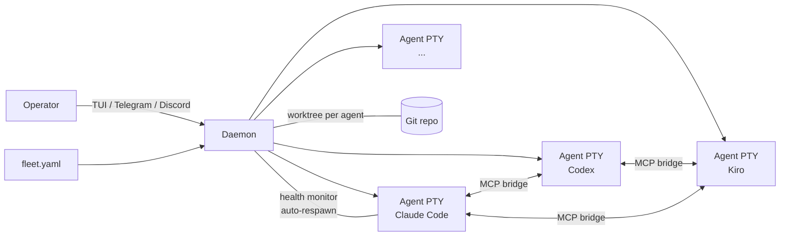

[繁體中文](README.zh-TW.md)

[](https://github.com/suzuke/agend-terminal/actions/workflows/ci.yml)
[](https://crates.io/crates/agend-terminal)
[](LICENSE)


# AgEnD Terminal

Orchestrate AI coding agents — not just run them.

Declare your entire AI dev team in one `fleet.yaml`. AgEnD Terminal launches each agent as a long-lived PTY process with its own git worktree, wires up inter-agent communication via built-in MCP tools, and keeps everything running with auto-respawn and context handover.

## Features

- **Fleet-as-code** — One YAML file declares every agent's backend, role, working directory, and team membership. `agend-terminal start` brings the whole fleet up.
- **5 backends** — Claude Code, Codex, Kiro, OpenCode, and Antigravity CLI. Swap backends by changing one field.
- **Built-in agent coordination** — Agents delegate tasks, query each other, and broadcast updates through 35 MCP tools. No glue code.
- **Automatic git worktree isolation** — Each agent works in its own worktree. No merge conflicts between agents, no accidental cross-contamination.
- **Crash recovery with context handover** — Agents auto-respawn and resume their conversation. Exponential backoff, health monitoring, and hung detection built in.
- **Remote control** — Drive the fleet through a multi-pane TUI, Telegram, or Discord. Get notifications when agents need attention.

## Quick Start

```bash
cargo install agend-terminal
agend-terminal quickstart    # Interactive setup in 2 minutes
agend-terminal start         # Launch the fleet
```

## Architecture



## Why Not tmux?

| | tmux + shell scripts | agend-terminal |
|---|---|---|
| Input injection | `send-keys` race conditions | Atomic PTY write |
| Output capture | Screen scraping | VTerm state tracking |
| Agent health | Manual monitoring | Auto-respawn + state detection |
| Multi-agent comms | Custom IPC | Built-in MCP tools |
| Git isolation | Manual worktrees | Auto per-agent worktree |

## Backends

| Backend | Command | Status |
|---------|---------|--------|
| Claude Code | `claude` | Tested |
| Kiro CLI | `kiro-cli` | Tested |
| Codex | `codex` | Tested |
| OpenCode | `opencode` | Tested |
| Antigravity CLI | `agy` | Tested |

> Gemini CLI was retired in [#1580](https://github.com/suzuke/agend-terminal/issues/1580) (it sunsets 2026-06-18 for free/Pro/Ultra tiers). Antigravity CLI (`agy`) is its official successor and a **supported** Fleet MCP backend ([#1547](https://github.com/suzuke/agend-terminal/issues/1547)). A `gemini` backend in fleet.yaml now spawns as a generic `Raw` backend.
> agy refuses any workspace whose path has a dot-prefixed (hidden) ancestor, so daemon agents under `~/.agend-terminal` were invisible to it. The daemon now creates a non-hidden link (`<base>/<instance>` → the hidden real workspace) and spawns agy with `$PWD` pointed at that link, clearing agy's hidden-path guard while the real files stay under `$AGEND_HOME`. `configure_agy` writes the project-scoped `.agents/mcp_config.json` + `.agents/AGENTS.md` (agy's official Customization Roots), so `agy` loads the fleet `send`/`inbox`/`task` tools like every other backend.

## Documentation

**Start here:**
- [Quick Start Guide](docs/FEATURE-quickstart.md) — First-run walkthrough
- [Fleet Configuration](docs/FEATURE-fleet.md) — `fleet.yaml` reference
- [CLI Reference](docs/CLI.md) — All subcommands
- [MCP Tools](docs/MCP-TOOLS.md) — 35 agent coordination tools
- [Known Issues](docs/KNOWN_ISSUES.md) — Intentionally-deferred items; check before filing an issue

<details>
<summary><strong>Feature guides</strong></summary>

**Core**
- [Agent Interaction](docs/FEATURE-agent-interaction.md)
- [TUI Interface](docs/FEATURE-tui.md)
- [Skills System](docs/FEATURE-skills.md)
- [Communication](docs/FEATURE-communication.md)
- [Task Board](docs/FEATURE-task-board.md)
- [Teams](docs/FEATURE-teams.md)
- [Git Worktree Isolation](docs/FEATURE-worktree.md)

**Advanced**
- [CI Watch](docs/FEATURE-ci-watch.md)
- [Health & Monitoring](docs/FEATURE-health.md)
- [Dispatch Idle Tracking](docs/FEATURE-dispatch-idle.md)
- [Channels (Telegram/Discord)](docs/FEATURE-channels.md)
- [Decision Records](docs/FEATURE-decisions.md)
- [Schedules & Deployments](docs/FEATURE-schedules.md)

**Maintenance**
- [Service Management](docs/FEATURE-service.md)
- [Diagnostics](docs/FEATURE-diagnostics.md)
- [Configuration](docs/FEATURE-configuration.md)
</details>

<details>
<summary><strong>Reference</strong></summary>

- [Architecture](docs/architecture.md) — Worktree isolation, health monitoring, Telegram lifecycle, daemon design
- [Git Behavior](docs/GIT-BEHAVIOR.md) — What the daemon modifies in spawned agents' git environment
- [Recipes](docs/RECIPE-clean-claude-instance.md) — Spawning a clean Claude Code instance
- [Contributing](CONTRIBUTING.md)
- [Changelog](CHANGELOG.md)
</details>

## Git Behavior

agend-terminal modifies git behavior for spawned agents (PATH shim, commit trailers, deny matrix, daemon-managed worktrees). Your own terminal is **not** affected. Read [`docs/GIT-BEHAVIOR.md`](docs/GIT-BEHAVIOR.md) before starting the daemon.

## License

MIT
