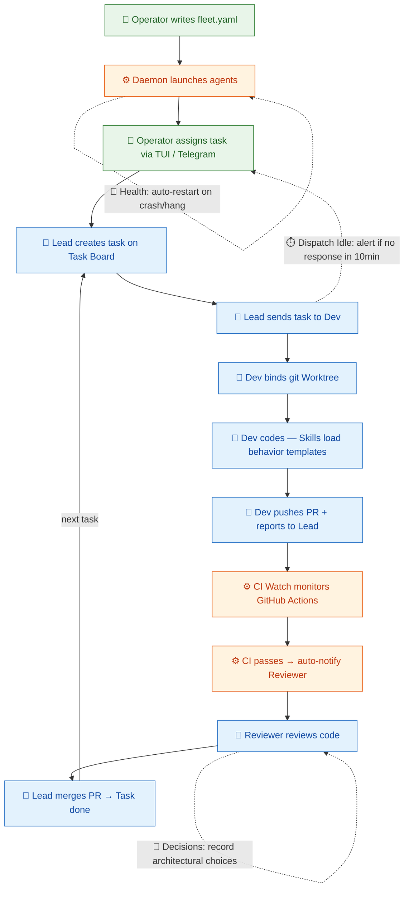

[繁體中文](README.zh-TW.md)

# AgEnD Terminal

Orchestrate AI coding agents — not just run them.

> ⚠️ **Pre-alpha.** APIs, CLI flags, and `fleet.yaml` schema may change
> between minor versions. Not for production use. Pin a specific version
> and read the release notes before upgrading.

```bash
cargo install agend-terminal
agend-terminal demo    # Try it in 30 seconds
```

## ⚠️ Git Behavior Modification (Important)

agend-terminal modifies git behavior for spawned agents (PATH shim, commit
trailers, deny matrix, daemon-managed worktrees). Your own terminal is
**not** affected.

**Read [`docs/GIT-BEHAVIOR.md`](docs/GIT-BEHAVIOR.md) before starting the daemon** — what gets modified, why, the risk surface, and the opt-out paths are all documented there.

## What It Does

Spawns AI coding agents (Claude Code, Codex, Kiro, OpenCode, Gemini, Antigravity) as
long-lived PTY processes, each in its own git worktree. A built-in MCP
server lets agents talk to each other — delegate work, request info,
broadcast updates — without glue code. Crashes are survived by auto-
respawn with context handover. Drive the fleet through a multi-tab /
multi-pane TUI, a Telegram channel, or an optional system tray.

## Why Not tmux?

| | tmux + shell scripts | agend-terminal |
|---|---|---|
| Input injection | `send-keys` race conditions | Atomic PTY write |
| Output capture | Screen scraping | VTerm state tracking |
| Agent health | Manual monitoring | Auto-respawn + state detection |
| Multi-agent comms | Custom IPC | Built-in MCP tools |
| Git isolation | Manual worktrees | Auto per-agent worktree |

## Development Workflow

How a task flows through the multi-agent pipeline. Each step shows which feature is active.



Legend: 🟢 Green = Operator action · 🔵 Blue = Agent behavior (via MCP tools) · 🟠 Orange = Daemon automation

> **Always running in background:** Health & Monitoring (auto-restart), Channels (Telegram sync), Schedules (cron jobs), Diagnostics (troubleshooting)

## Quick Start

```bash
# Demo (no config)
agend-terminal demo

# Interactive setup — detects backends, optionally wires Telegram, writes fleet.yaml
agend-terminal quickstart

# Or hand-write a minimum fleet.yaml and start the daemon:
cat > ~/.agend/fleet.yaml << 'YAML'
defaults:
  backend: claude
instances:
  dev:
    role: "Developer"
    working_directory: ~/my-project
  reviewer:
    role: "Code reviewer"
    working_directory: ~/my-project
YAML
agend-terminal start
```

For optional Telegram binding (remote control + outbound alerts), see [`docs/USAGE.md` § Channel: Telegram](docs/USAGE.md#channel-telegram).

## Backends

| Backend | Command | Status |
|---------|---------|--------|
| Claude Code | `claude` | Tested |
| Kiro CLI | `kiro-cli` | Tested |
| Codex | `codex` | Tested |
| OpenCode | `opencode` | Tested |
| Gemini CLI | `gemini` | Tested (sunsets 2026-06-18 for free/Pro/Ultra; paid Code Assist Standard/Enterprise retain access) |
| Antigravity CLI | `antigravity-cli` (binary `agy`) | Tested (#987 — Gemini CLI's official successor; #995 polish). **Fleet MCP bridge unsupported in current AGY release** — agy instances spawn without `send`/`inbox`/`task` tools (operators see a `[fleet-mcp-unsupported]` warn in `app.log`). Use for manual work; await upstream fix at `google-antigravity/antigravity-cli`. |

## Learn More

### Feature Guides

**Getting Started**
- [Quick Start Guide](docs/FEATURE-quickstart.md)
- [Fleet Configuration](docs/FEATURE-fleet.md)
- [Agent Interaction](docs/FEATURE-agent-interaction.md)

**Daily Usage**
- [TUI Interface](docs/FEATURE-tui.md)
- [Skills System](docs/FEATURE-skills.md)
- [Communication](docs/FEATURE-communication.md)
- [Task Board](docs/FEATURE-task-board.md)
- [Teams](docs/FEATURE-teams.md)
- [Git Worktree Isolation](docs/FEATURE-worktree.md)

**Advanced**
- [CI Watch](docs/FEATURE-ci-watch.md)
- [Health & Monitoring](docs/FEATURE-health.md)
- [Dispatch Idle Tracking](docs/FEATURE-dispatch-idle.md)
- [Channels (Telegram/Discord)](docs/FEATURE-channels.md)
- [Decision Records](docs/FEATURE-decisions.md)
- [Schedules & Deployments](docs/FEATURE-schedules.md)

**Maintenance**
- [Service Management](docs/FEATURE-service.md)
- [Diagnostics](docs/FEATURE-diagnostics.md)
- [Configuration](docs/FEATURE-configuration.md)

### Reference

- **Commands** — [`docs/CLI.md`](docs/CLI.md) for the full subcommand reference.
- **MCP tools** — [`docs/MCP-TOOLS.md`](docs/MCP-TOOLS.md) for the 35 agent-to-agent coordination tools.
- **Architecture** — [`docs/architecture.md`](docs/architecture.md) covers git worktree isolation, health monitoring + auto-respawn, Telegram topic lifecycle, and daemon-resident design.
- **Recipes** — [`docs/RECIPE-clean-claude-instance.md`](docs/RECIPE-clean-claude-instance.md) for spawning a Claude Code instance without inherited global instructions or auto-memory.
- **Contributing** — [`CONTRIBUTING.md`](CONTRIBUTING.md).
- **Release history** — [`CHANGELOG.md`](CHANGELOG.md).

## License

MIT
