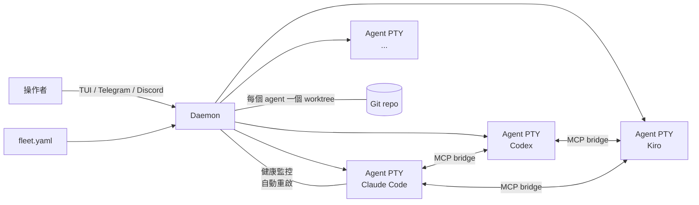

[English](README.md)

[](https://github.com/suzuke/agend-terminal/actions/workflows/ci.yml)
[](https://crates.io/crates/agend-terminal)
[](LICENSE)


# AgEnD Terminal

統籌 AI coding agent——不只是執行它們。

用一份 `fleet.yaml` 宣告你的整個 AI 開發團隊。AgEnD Terminal 會把每個 agent 啟動成長駐的 PTY process，配上各自獨立的 git worktree，透過內建的 MCP 工具串起 agent 之間的溝通，再以自動重啟與上下文移交把整個團隊維持運轉。

> ⚠️ **Pre-alpha。** API、CLI 旗標與 `fleet.yaml` 結構可能在小版本之間變動，尚不適合用於生產環境。請鎖定特定版本，升級前先讀 release notes。

## 功能特色

- **Fleet-as-code** — 一份 YAML 就宣告完每個 agent 的 backend、role、工作目錄與所屬 team。`agend-terminal start` 一次把整個 fleet 拉起來。
- **5 種 backend** — Claude Code、Codex、Kiro、OpenCode、Antigravity CLI。換 backend 只要改一個欄位。
- **內建 agent 協調** — agent 之間透過 30 個 MCP 工具委派工作、互相查詢、廣播更新，不需要任何膠水程式碼。
- **自動 git worktree 隔離** — 每個 agent 在自己的 worktree 裡工作。agent 之間不會有 merge 衝突，也不會意外互相污染。
- **Crash 後自動復原並移交上下文** — agent 會自動重啟並接續原本的對話。內建指數退避、健康監控與 hung 偵測。
- **遠端操控** — 透過多 pane 的 TUI、Telegram 或 Discord 操控整個 fleet，agent 需要你介入時會主動通知。

## 快速開始

```bash
cargo install agend-terminal
agend-terminal quickstart    # 互動式設定，2 分鐘完成
agend-terminal start         # 啟動 fleet
```

### 無人值守設定（CI / 腳本）

`quickstart --unattended` 永遠不讀 stdin、不等待網路——缺少必填輸入會是明確的錯誤與非零退出碼，而不是卡住。backend 取 `PATH` 上偵測到的第一個（若都沒有，會列出安裝指令並退出）；Telegram 為選用，從環境變數讀取：

```bash
# 最小設定（不含 Telegram——產出的 channel 區塊會被註解掉）：
agend-terminal quickstart --unattended

# 含 Telegram（token 會直接存下不驗證，由 daemon 在啟動時驗證）：
AGEND_TELEGRAM_BOT_TOKEN=123:abc \
AGEND_TELEGRAM_GROUP_ID=-1001234567890 \
agend-terminal quickstart --unattended
```

重跑具備冪等性：既有的 `fleet.yaml` 永遠不會被覆寫，既有 `.env` 內的 token 只有在明確設定 `AGEND_TELEGRAM_BOT_TOKEN` 時才會被取代（例如 CI 輪換 token）。GitHub Actions 範例步驟：

```yaml
- name: Bootstrap agend-terminal
  env:
    AGEND_TELEGRAM_BOT_TOKEN: ${{ secrets.AGEND_TELEGRAM_BOT_TOKEN }}
  run: |
    cargo install agend-terminal
    agend-terminal quickstart --unattended
```

## 架構



## 為什麼不用 tmux？

| | tmux + shell 腳本 | agend-terminal |
|---|---|---|
| 輸入注入 | `send-keys` 競態條件 | 原子 PTY 寫入 |
| 輸出擷取 | 螢幕刮取 | VTerm 狀態追蹤 |
| Agent 健康 | 手動監控 | 自動重啟 + 狀態偵測 |
| 多 agent 通訊 | 自訂 IPC | 內建 MCP 工具 |
| Git 隔離 | 手動 worktree | 自動 per-agent worktree |

## Backend 支援

| Backend | 命令 | 狀態 |
|---------|------|------|
| Claude Code | `claude` | 已測試 |
| Kiro CLI | `kiro-cli` | 已測試 |
| Codex | `codex` | 已測試 |
| OpenCode | `opencode` | 已測試 |
| Antigravity CLI | `agy` | 已測試 |

> Gemini CLI 已於 [#1580](https://github.com/suzuke/agend-terminal/issues/1580) 退役（2026-06-18 起對免費／Pro／Ultra 方案停止服務）。其官方後繼者 Antigravity CLI（`agy`）已是受支援的 Fleet MCP backend（[#1547](https://github.com/suzuke/agend-terminal/issues/1547)）。`fleet.yaml` 內若仍指定 `gemini`，現在會以泛用的 `Raw` backend 啟動。
> `agy` 會拒絕任何路徑帶有 dot 前綴（隱藏）祖先目錄的 workspace，因此 `~/.agend-terminal` 底下的 daemon agent 原本對它是不可見的。daemon 現在會建立一個非隱藏的連結（`<base>/<instance>` → 真正的隱藏 workspace），並把 agy 的 `$PWD` 指向該連結，藉此通過 agy 的隱藏路徑檢查，而真實檔案仍留在 `$AGEND_HOME` 底下。`configure_agy` 會寫入 project-scoped 的 `.agents/mcp_config.json` + `.agents/AGENTS.md`（agy 官方的 Customization Roots），讓 `agy` 像其他 backend 一樣載入 fleet 的 `send`／`inbox`／`task` 工具。

## 文件

**從這裡開始：**
- [快速開始指南](docs/FEATURE-quickstart.zh-TW.md) — 首次啟動逐步教學
- [Fleet 設定](docs/FEATURE-fleet.zh-TW.md) — `fleet.yaml` 參考
- [CLI 參考](docs/CLI.zh-TW.md) — 所有子命令
- [MCP 工具](docs/MCP-TOOLS.zh-TW.md) — 30 個 agent 協調工具
- [已知問題](docs/KNOWN_ISSUES.zh-TW.md) — 刻意暫緩的項目；開 issue 前請先看
- [**文件總索引**](docs/README.zh-TW.md) — 所有指南與參考文件的雙語地圖

<details>
<summary><strong>功能指南</strong></summary>

**核心**
- [Agent 互動](docs/FEATURE-agent-interaction.zh-TW.md)
- [TUI 介面](docs/FEATURE-tui.zh-TW.md)
- [Skills 技能系統](docs/FEATURE-skills.zh-TW.md)
- [通訊系統](docs/FEATURE-communication.zh-TW.md)
- [任務看板](docs/FEATURE-task-board.zh-TW.md)
- [團隊](docs/FEATURE-teams.zh-TW.md)
- [Git Worktree 隔離](docs/FEATURE-worktree.zh-TW.md)

**進階**
- [CI 監控](docs/FEATURE-ci-watch.zh-TW.md)
- [健康與監控](docs/FEATURE-health.zh-TW.md)
- [Dispatch Idle 追蹤](docs/FEATURE-dispatch-idle.zh-TW.md)
- [頻道（Telegram／Discord）](docs/FEATURE-channels.zh-TW.md)
- [決策記錄](docs/FEATURE-decisions.zh-TW.md)
- [排程與部署](docs/FEATURE-schedules.zh-TW.md)

**維運**
- [服務管理](docs/FEATURE-service.zh-TW.md)
- [診斷工具](docs/FEATURE-diagnostics.zh-TW.md)
- [設定](docs/FEATURE-configuration.zh-TW.md)
</details>

<details>
<summary><strong>參考文件</strong></summary>

- [架構](docs/architecture.zh-TW.md) — worktree 隔離、健康監控、Telegram 生命週期、daemon 設計
- [Git 行為](docs/GIT-BEHAVIOR.zh-TW.md) — daemon 對被啟動 agent 的 git 環境做了哪些修改
- [秘訣](docs/RECIPE-clean-claude-instance.zh-TW.md) — 啟動一個乾淨的 Claude Code instance
- [貢獻指南](CONTRIBUTING.zh-TW.md)
- [更新日誌](CHANGELOG.zh-TW.md)
</details>

## Git 行為

agend-terminal 會修改被啟動 agent 的 git 行為（PATH shim、commit trailer、deny matrix、daemon 管理的 worktree）。你自己的終端機**不受影響**。啟動 daemon 前請先讀 [`docs/GIT-BEHAVIOR.zh-TW.md`](docs/GIT-BEHAVIOR.zh-TW.md)。

## 授權條款

MIT
