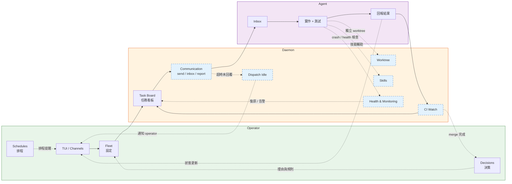

[English](README.md)

# AgEnD Terminal

統籌 AI coding agent——不只是執行它們。

> ⚠️ **Pre-alpha。** API、CLI 旗標和 `fleet.yaml` 結構可能在小版本之間
> 變動。不適合用於生產環境。請鎖定特定版本，升級前先閱讀 release notes。

```bash
cargo install agend-terminal
agend-terminal demo    # 30 秒快速體驗
```

## ⚠️ Git 行為修改（重要）

agend-terminal 會修改被啟動的 agent 的 git 行為（PATH shim、commit
trailer、deny matrix、daemon 管理的 worktree）。你自己的終端**不受影響**。

**啟動 daemon 前請先閱讀 [`docs/GIT-BEHAVIOR.md`](docs/GIT-BEHAVIOR.md)**——裡面記錄了哪些被修改、為什麼、風險範圍，以及 opt-out 路徑。

## 功能介紹

啟動 AI coding agent（Claude Code、Codex、Kiro、OpenCode、Gemini、Antigravity）
作為長駐 PTY process，每個都有獨立的 git worktree。內建 MCP server 讓
agent 之間可以互相溝通——委派工作、查詢資訊、廣播更新——不需要膠水程式碼。
Crash 後自動重啟並移交上下文。透過多 tab / 多 pane 的 TUI、Telegram 頻道或
可選的系統匣來操控整個 fleet。

## 為什麼不用 tmux？

| | tmux + shell scripts | agend-terminal |
|---|---|---|
| 輸入注入 | `send-keys` 競態條件 | 原子 PTY 寫入 |
| 輸出擷取 | 螢幕刮取 | VTerm 狀態追蹤 |
| Agent 健康 | 手動監控 | 自動重啟 + 狀態偵測 |
| 多 Agent 通訊 | 自訂 IPC | 內建 MCP 工具 |
| Git 隔離 | 手動 worktree | 自動 per-agent worktree |

## 開發流程

這是一個把系統看成「操作者 → agent → 完成」循環的替代視角，而不是功能分類表。
虛線框（- - -）為 agent 基礎設施——agent 透過 MCP 工具使用。
實線框為 operator 面向功能。



## 快速開始

```bash
# 示範（無需設定）
agend-terminal demo

# 互動式設定——偵測 backend、可選設定 Telegram、產生 fleet.yaml
agend-terminal quickstart

# 或手寫一份最小 fleet.yaml 然後啟動 daemon：
cat > ~/.agend/fleet.yaml << 'YAML'
defaults:
  backend: claude
instances:
  dev:
    role: "Developer"
    working_directory: ~/my-project
  reviewer:
    role: "Code reviewer"
    working_directory: ~/my-project
YAML
agend-terminal start
```

Telegram 綁定（遠端控制 + 外發通知）請參閱 [`docs/USAGE.md` § Channel: Telegram](docs/USAGE.md#channel-telegram)。

## Backend 支援

| Backend | 命令 | 狀態 |
|---------|------|------|
| Claude Code | `claude` | 已測試 |
| Kiro CLI | `kiro-cli` | 已測試 |
| Codex | `codex` | 已測試 |
| OpenCode | `opencode` | 已測試 |
| Gemini CLI | `gemini` | 已測試（2026-06-18 起免費/Pro/Ultra 停止服務；付費 Code Assist Standard/Enterprise 保留存取） |
| Antigravity CLI | `antigravity-cli`（二進位 `agy`） | 已測試（#987——Gemini CLI 的官方繼任者；#995 polish）。**目前 AGY 版本不支援 Fleet MCP bridge**——agy instance 啟動時不具備 `send`/`inbox`/`task` 工具（operator 會在 `app.log` 中看到 `[fleet-mcp-unsupported]` 警告）。適合手動作業；等待上游 `google-antigravity/antigravity-cli` 修復。 |

## 深入了解

### 功能指南

**入門**
- [快速開始指南](docs/FEATURE-quickstart.zh-TW.md)
- [Fleet 設定](docs/FEATURE-fleet.zh-TW.md)
- [Agent 互動](docs/FEATURE-agent-interaction.zh-TW.md)

**日常使用**
- [TUI 介面](docs/FEATURE-tui.zh-TW.md)
- [Skills 技能系統](docs/FEATURE-skills.zh-TW.md)
- [通訊系統](docs/FEATURE-communication.zh-TW.md)
- [任務看板](docs/FEATURE-task-board.zh-TW.md)
- [團隊](docs/FEATURE-teams.zh-TW.md)
- [Git Worktree 隔離](docs/FEATURE-worktree.zh-TW.md)

**進階**
- [CI 監控](docs/FEATURE-ci-watch.zh-TW.md)
- [健康與監控](docs/FEATURE-health.zh-TW.md)
- [Dispatch Idle 追蹤](docs/FEATURE-dispatch-idle.zh-TW.md)
- [頻道（Telegram/Discord）](docs/FEATURE-channels.zh-TW.md)
- [決策記錄](docs/FEATURE-decisions.zh-TW.md)
- [排程與部署](docs/FEATURE-schedules.zh-TW.md)

**維運**
- [服務管理](docs/FEATURE-service.zh-TW.md)
- [診斷工具](docs/FEATURE-diagnostics.zh-TW.md)
- [設定](docs/FEATURE-configuration.zh-TW.md)

### 參考文件

- **命令**——[`docs/CLI.md`](docs/CLI.md) 完整子命令參考。
- **MCP 工具**——[`docs/MCP-TOOLS.md`](docs/MCP-TOOLS.md) 35 個 agent 間協作工具。
- **架構**——[`docs/architecture.md`](docs/architecture.md) 涵蓋 git worktree 隔離、健康監控 + 自動重啟、Telegram topic 生命週期，以及 daemon-resident 設計。
- **秘訣**——[`docs/RECIPE-clean-claude-instance.md`](docs/RECIPE-clean-claude-instance.md) 啟動不含全域指令或 auto-memory 的乾淨 Claude Code instance。
- **貢獻**——[`CONTRIBUTING.md`](CONTRIBUTING.md)。
- **發布歷史**——[`CHANGELOG.md`](CHANGELOG.md)。

## 授權條款

MIT
