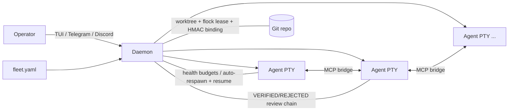

[繁體中文](competitor-comparison.zh-TW.md)

# Competitor Comparison: AgEnD Terminal vs the 2026 Agent-Orchestration Landscape

> **Provenance / freshness.** Synthesized from a 2026-06 multi-agent research pass
> (one grounding sweep over AgEnD's own source + thirteen per-competitor deep dives;
> open-source competitors were cloned and read at the source level, closed ones
> characterised from docs + live search). Decision-relevant facts were
> adversarially fact-checked (27 load-bearing claims; the large majority confirmed,
> the few misses skewed toward *under*-stating competitors). **Popularity, funding,
> and version figures are point-in-time (mid-2026) and WILL drift** — treat the
> star/funding columns as a rough size signal, not a current quote. The stable
> references are the architectural and coordination characterisations, not the
> numbers. Supersedes the original three-way doc (AgEnD vs Multica vs OpenAB),
> which is folded into §5.8.

## 1. TL;DR

AgEnD Terminal is a **single-operator, zero-infra, real-time control layer** for a
fleet of AI coding CLIs. Its defensible moat is the combination almost no
competitor has at once: **live operator-in-the-loop control** (multi-pane TUI,
`interrupt`, `pane_snapshot`, `replace_instance`) + a **structured review chain**
(VERIFIED/REJECTED verdicts, claim-verify trailers checked against the diff,
auto-dispatched reviewer) + **git-worktree isolation with a policy gate**
(per-branch flock lease, HMAC-signed binding, the `agend-git` deny matrix) +
**crash-respawn with conversation resume** — all in three self-contained Rust
binaries with file-based state.

The landscape has expanded far past the original doc's two subjects. The market
now splits into eight categories (§3). The honest tensions: AgEnD's three biggest
self-identified gaps — **fragile PTY screen-scraping for state detection**,
**worktree-only isolation** (shared host FS/deps/network), and **no
structured-protocol / async-headless mode** — are exactly the areas where a
half-dozen independent competitors have converged on better answers (§8, §9). And
three funded incumbents (GitHub Agent HQ, Cursor 3.0 Agents Window, Devin Desktop)
are now executing AgEnD's own thesis, which raises the bar on what "orchestrate,
not just run" has to mean (§5.8, §11).

## 2. AgEnD's position — the Control layer

The agent-tooling stack has three abstraction layers. AgEnD owns the third:

| Layer | What it is | Representative tools |
|---|---|---|
| Communication | chat ↔ agent bridge | OpenAB, chat-first bots |
| Management | task → agent → report | Multica, Vibe Kanban, Task Master |
| **Control** | **operator → fleet → quality gate → result** | **AgEnD Terminal** |

The control layer's premise is that a single power-user **commands a fleet in real
time** — watching live output, interrupting bad work mid-thought, course-correcting
before a task is burned, and gating results through a structured review chain. This
requires deep daemon-PTY integration (`vterm.rs`, `render/`, `layout/`,
`keybinds.rs`) and a coordination spine (~30-36 MCP tools, an event-sourced task
board) that the other layers were not designed to carry. See
[architecture.md](architecture.md) for the structural map.

## 3. The landscape (eight categories)

**Bold** = the categories that overlap AgEnD's architecture most directly.

| Category | Representatives (mid-2026 size signal) | Isolation | Relationship to AgEnD |
|---|---|---|---|
| **Terminal worktree-parallel managers** | **Claude Squad** (~7.8k★, Go), **uzi** (~579★, dormant), NTM / tmai / CAO (new cohort) | git worktree | Closest peers; none have a daemon, MCP board, review chain, or recovery |
| **Desktop GUI parallel managers** | **Conductor** (closed, $22M A), **Crystal/Nimbalyst** (~3k★, Electron), **Sculptor** (Imbue, containers), **Cursor 3.0 Agents Window** | worktree / container | Same thesis, GUI surface; Conductor's per-worktree scripts + ports are the cleanest borrow |
| **Kanban / task orchestration** | **Vibe Kanban** (~27k★, Rust, sunset), Task Master (~27k★), Backlog.md (~5k★), Roo Boomerang | worktree / none | VK ships an ACP executor + scoped orchestrator MCP; Task Master has PRD→tasks + dependency DAG |
| **Swarm / library frameworks** | claude-flow/Ruflo (~59k★), claude-swarm, AutoGen (maintenance), CrewAI (~48k★), LangGraph (LangChain unicorn), MetaGPT (~50k★), OpenHands (~70k★) | none / container-for-code | Don't supervise real CLIs; valuable for typed handoff, durable checkpoint, event-sourced state, headless |
| **Env-isolation / sandbox runtimes** | **container-use** (Dagger, ~3.9k★), E2B (Firecracker), Modal (gVisor), Daytona | container / microVM | The answer to AgEnD's #1 isolation gap; belongs as an opt-in tier |
| **Cloud / async coding agents** | Devin (~$26B val), Jules, Cursor Cloud, Copilot coding agent, Factory (~$1.5B), Codex cloud | cloud VM | Set the "assign-issue → PR + headless + mobile trigger" UX expectation |
| **Interop protocols** | **ACP** (Zed, ~3.4k★, 25+ agents), A2A (Google→Linux Foundation), MCP, AG-UI | n/a (wire format) | ACP is the highest-leverage fix for AgEnD's fragile "eyes" |
| **Terminal-native / pair** | Warp Oz, Wave (~20k★), tmuxai, Aider (~46k★) | cloud / none | Aider repo-map + tmuxai OSC-133 markers are the standout borrows |

## 4. Closest architectural peers (deep dive)

These occupy AgEnD's exact niche: spawn N coding agents, each in its own git
worktree. AgEnD's moat over all of them is the daemon + MCP coordination + review
chain + recovery; their lessons are concrete and cheap.

### 4.1 Claude Squad (`smtg-ai/claude-squad`, Go, ~7.8k★)
- **Model:** tmux session + git worktree per agent; the manager holds a PTY to
  `tmux attach`. Worktrees under `~/.claude-squad/worktrees/...`
  (`session/git/worktree.go`). Pause = commit dirty work + remove worktree (keep
  branch); Resume = re-add worktree + reattach tmux (`session/instance.go`).
- **Weaker than AgEnD:** no flock lease, no HMAC binding, no daemon-managed
  bind/release/GC, no git policy gate, and **no inter-agent coordination at all**
  (verified: only a trust-prompt screen-scrape).
- **Borrowable:** (a) *tmux-owns-the-process* as an optional durable-PTY backend —
  the agent survives daemon death and is reattachable out-of-band; (b)
  *Pause = commit + drop worktree / Resume = re-add* as a first-class lifecycle
  state to reclaim disk + checkout slots without killing work; (c) *alias-resolving
  spawn* (source the user's shell rc, unwrap aliases before launching) — AgEnD's
  PTY spawn will hit the same "works in my shell, not when spawned" class.

### 4.2 Conductor (`conductor.build`, closed, native macOS, $22M Series A)
- **Model:** worktree per workspace; same shared-host model as AgEnD. External
  reviews note **no pre-spawn collision detection and no automatic per-worktree
  DB/env isolation** — that burden is on the user's scripts.
- **Borrowable (highest-value, fully philosophy-aligned):** *per-worktree lifecycle
  scripts with injected env* — an AgEnD-managed setup/run/archive hook set exposing
  `AGEND_PORT` (auto-allocated non-colliding port), `AGEND_WORKTREE_NAME/PATH`,
  `AGEND_REPO_ROOT`, so each worktree installs deps, copies gitignored files
  (`.env`), and runs a namespaced dev server. Also: *archive + restore* lifecycle,
  and *diff-hunk-as-instruction* (select a hunk → generate a scoped `send()`).

### 4.3 Crystal / Nimbalyst (`stravu/crystal`, Electron, ~3k★)
- **Model:** worktree per session; drives Claude **purely off
  `--output-format stream-json`** — no screen-scraping (verified;
  `claudeCodeManager.ts`).
- **Borrowable:** (a) *structured-output ingestion mode* — parse JSON events as a
  high-confidence state signal, scraping demoted to fallback; (b) *per-prompt
  execution diff* — record the commit hash before each instruction, compute the
  diff that turn produced, keyed to the prompt (`executionTracker.ts`) → strengthens
  claim-verify; (c) *checkpoint commit mode* (auto-commit each turn); (d) safe
  *`git merge-tree` conflict pre-check* before merge-back; (e) *recursive
  process-tree teardown* on interrupt/replace (AI CLIs leak node/mcp/build children
  if you only kill the PTY leader).

### 4.4 uzi (`devflowinc/uzi`, Go, ~579★, dormant)
- **Model:** worktree + tmux per agent; auto-commit; per-agent dev server.
- **Borrowable:** (a) *per-agent dev server with collision-safe port allocation* +
  a clickable preview URL in the fleet view — the `findAvailablePort` logic
  (`cmd/prompt/prompt.go`) is ~20 lines, directly portable to Rust; unlocks the
  killer move of *racing N agents on a UI task and diffing the live previews*;
  (b) *`fleet run "<cmd>"`* — run one shell command across every worktree and
  collect per-agent stdout/exit (distinct from prompt-broadcast; route it through
  the `agend-git` policy gate); (c) a live *diff-size column* (use
  `git diff --shortstat HEAD` to avoid touching the index).

### 4.5 Vibe Kanban (`BloopAI/vibe-kanban`, Rust + React, ~27k★, sunset)
- **Model:** worktree per workspace; default profiles ship full-autonomy/yolo flags
  per agent (`crates/executors/default_profiles.json`), so isolation rests entirely
  on the worktree. Ships a real *Orchestrator MCP mode* (verified:
  `create_session/run_session_prompt/get_execution/list_sessions`).
- **Borrowable (Rust blueprints AgEnD can read directly):** (a) *ACP backend
  transport* — `crates/executors/src/executors/acp/harness.rs` (tokio + the
  `agent_client_protocol` crate) is a reusable piped-child + JSON-RPC harness;
  (b) *structured approvals/questions protocol* (`approvals.rs`) — agents emit
  tool-permission / ask-user requests as typed events; (c) *declarative per-task
  action pipeline* (`ExecutorAction` linked list: setup → agent → cleanup →
  reviewer, advanced on process exit); (d) *per-agent capability negotiation enum*;
  (e) *scoped orchestrator MCP mode* (a deliberately restricted, workspace-scoped
  tool router that strips `delete_workspace`).

## 5. Adjacent categories — the one thing each teaches

### 5.1 Swarm frameworks — claude-flow, claude-swarm
- **Reality check (verified):** claude-flow/Ruflo (~59k★) is a coordination/memory
  **ledger, not an executor** — its `AGENTS.md` states "claude-flow does **NOT**
  execute code!"; "swarm/queen/consensus" run over logical in-memory nodes
  (`Agent.executeTask` is a no-op stub), "intelligent routing" is an 8-entry regex
  map (`router.cjs`), and the "neural" surface is hash-based pseudo-embeddings.
  claude-swarm gives per-instance directory + tool scoping over a *shared* tree.
- **Borrowable:** (a) *per-agent tool-permission scoping in the manifest*
  (allow/deny matrix per role — cheap, hardens the shared-host weakness); (b)
  *dependency-graph / parallel-wave execution* (auto-dispatch a task only when its
  upstream tasks are VERIFIED); (c) *auto-claim next board task on idle*.
- **Do NOT copy:** the queen/topology/consensus (Raft/Byzantine) layer — it solves a
  problem AgEnD doesn't have (the operator *is* the decision authority).

### 5.2 Library frameworks — AutoGen / CrewAI / LangGraph / MetaGPT
- **What they do better (abstraction, not operations):** declarative topology as a
  serializable artifact (LangGraph `StateGraph`); **durable per-step checkpointing**
  (time-travel, pause-then-resume hours later); **typed handoff** messages validated
  against the roster (`HandoffMessage.target`); the MagenticOne facts+plan+stall-count
  ledger.
- **Where AgEnD is stronger:** no real agent isolation (one Python event loop; a
  hang stalls the loop), they orchestrate *API calls* not real coding CLIs, no live
  operator control, no git policy, no review chain.
- **Borrowable:** (a) a typed `handoff` MCP tool (target + reason + payload,
  roster-validated, logged on the board); (b) a declarative `routes:` topology block
  in `fleet.yaml` (coder → reviewer → coder); (c) **fleet-level durable
  checkpoint** — AgEnD already event-sources the board; promote it to a
  replayable/resumable checkpoint of fleet-wide progress; (d) semantic *stall
  detection* (alive-but-looping, which screen-scraping misses); (e) task-scoped
  `interrupt()` HITL distinct from `set_waiting_on`.

### 5.3 Autonomous platform — OpenHands (`All-Hands-AI`, ~70k★)
- **The single best teacher for AgEnD's #1 weakness.** Uses a typed,
  **event-sourced state model** (Action/Observation events, filesystem EventService)
  — deterministic, replayable, no screen-scraping. Pluggable `SandboxService`
  (Docker/Remote/Process/none) proves isolation can be a swappable strategy.
- **Where AgEnD is stronger:** not a real-time control plane (built for
  fire-and-forget → PR), no peer inter-agent coordination across top-level agents,
  it *is* a backend (its own agent loop) rather than a backend-orchestrator, heavy
  infra (FastAPI + DB + Docker/K8s + React).
- **Borrowable:** (a) **typed event stream as the primary truth, PTY scraping as
  fallback** — a per-instance JSON event log feeds reliable state; (b) an
  *EventCallbackProcessor* bus (subscribe to typed events to fire auto-review /
  notify / respawn, replacing regex triggers); (c) the *ProcessSandbox* pattern
  (no-container local: child on a unique port + session key + `/alive` poll +
  log-to-file to avoid pipe deadlock); (d) *spawn-vs-delegate split* with a
  `max_children` cap and results returned as structured observations.

### 5.4 Env-isolation runtimes — container-use (Dagger), Sculptor, E2B/Modal/Daytona
- **True container isolation** (container-use, verified at `repository/repository.go`,
  `environment/environment.go`): each env is a Dagger container (own root FS, deps,
  namespace) + a dedicated git branch + a real worktree; mutations export back to
  the worktree and commit/push to a per-repo bare fork; sidecar service containers
  (DB/cache) with port tunnels; secrets as Dagger secrets. E2B (Firecracker) / Modal
  (gVisor) define the 2026 bar for untrusted agent code (microVM).
- **Where AgEnD is stronger:** container-use has **no orchestration/control layer at
  all** — no fleet, roles, schedules, recovery, resume, or inter-agent coordination,
  and the relationship is *inverted* (the agent host spawns container-use; nothing
  supervises liveness). Hard Docker+Dagger dependency violates AgEnD's zero-infra
  ethos.
- **Borrowable:** (a) **opt-in container isolation tier** — `fleet.yaml:
  isolation: worktree|container`, where the daemon stays the supervisor and just
  puts the PTY child in a container bind-mounted to the *existing* worktree (the
  honest middle path: keep control + worktree-as-code, gain sandbox safety per
  agent); (b) *git-notes per-command audit trail* (`cu log/diff` — command + exit
  code + diff digest on the branch, no DB); (c) *typed multi-resource flock lock
  manager* (read vs write, `repository/flock.go`).

### 5.5 Cloud / async coding agents — Devin, Jules, Cursor, Copilot, Factory, Codex
- **They set the UX expectation:** true isolation (cloud VM / network-off),
  headless/async fire-and-forget, mobile/Slack triggering, issue → PR.
- **Their fatal weakness:** review only happens at the END (the PR). You cannot
  watch live, ESC-interrupt mid-thought, or course-correct before the task is burned
  — and pure human-dispatch fan-out creates the "Zero Alignment" failure (duplicated
  work, merge conflicts, a review backlog) because plans are never shared.
- **Borrowable (borrow the posture, not the cloud):** (a) *local headless detach +
  notify-on-done* (agent keeps running headless on the operator's box, pushes to
  Telegram on completion — reuses worktree/board/schedule/ci-watch, no cloud VM);
  (b) *issue → PR as a native workflow* but with AgEnD's structured verdict attached
  (the differentiator: a *reviewed* PR, not a black-box self-review); (c) a
  **pre-flight shared PLAN gate** — turn the competitors' alignment weakness into an
  AgEnD strength (agent posts a plan to the board/decisions → operator/peer ack →
  then writes code); (d) inbound *mobile dispatch/approve* over the existing channel;
  (e) *per-agent token burn-rate + budget caps* (cap-hit → auto-interrupt/pause);
  (f) a *Codex-style network-off-per-task* lightweight egress policy (short of full
  containers).

### 5.6 Interop protocols — ACP, A2A, MCP, AG-UI
- **ACP (Agent Client Protocol, Zed)** is the highest-leverage borrow for the
  fragile-"eyes" problem: typed `tool_call_update` status/kind, `agent_thought_chunk`,
  `plan_update`, `StopReason`, a `session/request_permission` model, and the client
  owning the filesystem/terminal (exact diffs + exit codes for claim-verify).
- **Honest limits:** ACP gives **zero multi-agent coordination** (AgEnD's whole
  control plane stays native); backend support is uneven across AgEnD's set
  (Gemini/Antigravity strong; Claude Code/Codex/Kiro/OpenCode adapter-to-absent), so
  **ACP is a *second* backend mode, not a replacement for PTY**; the v2 draft
  (2026-06) is in flux, so target v1.
- **Borrowable:** (a) an *optional ACP client-mode backend* in `fleet.yaml`; (b)
  *adopt ACP's typed state vocabulary as AgEnD's internal normalized state schema*
  even where PTY stays — this makes the regex scraper a thin adapter and lets the
  review chain reason over typed verdicts (low effort, high leverage, zero infra);
  (c) ACP's `session/request_permission` shape as the canonical approval/permission
  schema (unifies the operator approval UX with the `agend-git` deny matrix); (d)
  ACP's forward-compat discipline (`_meta` passthrough + `Other(...)` enum fallbacks
  + handshake capability negotiation) applied to AgEnD's MCP schemas.
- **A2A / AG-UI:** philosophy mismatch (A2A = HTTP multi-org cloud mesh; AG-UI =
  browser generative-UI). Only a thin optional A2A egress shim, and only on a
  concrete interop need.

### 5.7 Terminal-native & pair — Aider, tmuxai, Warp, Wave
- **Aider** (~46k★, verified zero MCP): single-agent single-tree, but a best-in-class
  *repo-map* (tree-sitter tags + PageRank ranking + token budget + cache,
  `repomap.py`) AgEnD has no equivalent of; the `AI!`/`AI?` comment trigger
  (`watch.py`) is a novel zero-TUI control surface; architect/editor is a
  planner/executor split. Notably, parallelizing Aider needs an *external* tool
  (dmux: tmux pane + worktree per agent) — which validates AgEnD's built-in design.
- **Borrowable:** (a) a native *repo-map MCP tool* (backend-agnostic codebase index
  any fleet agent can query); (b) *OSC-133 semantic prompt marks* / shell-marker
  injection as a high-confidence state oracle (tmuxai's Prepare Mode; supported by
  Warp/Wave/WezTerm/kitty), with regex as fallback; (c) the *architect → editor*
  handoff as a real fleet role (plan as a board artifact, operator approval gate,
  editor in its own worktree); (d) a per-edit *lint/test reflection loop* as an
  opt-in supervisor policy.

### 5.8 Prior doc subjects + incumbents now executing AgEnD's thesis

**Folded in from the original doc:**

- **Multica** (~32k★, Go + TS) — agent-HR management: web UI, issue board, multi-user
  shared agent pool. *Lesson AgEnD already absorbed:* workspace GC, per-agent
  timeout, task metadata KV, boot orphan sweep, max-concurrent guard. *Still NOT to
  copy:* the web UI / PostgreSQL / multi-user auth — they dissolve the single-operator,
  zero-infra, TUI-first differentiation.
- **OpenAB** (~515★, Rust) — chat-first ACP bridge routing Discord/Slack/Telegram/
  LINE/Feishu/Google-Chat/WeCom to any ACP CLI. *Lessons:* its ACP usage reinforces
  §5.6; its gateway-style channel architecture is cleaner than hardcoding Telegram
  into the daemon. *Not the primary UX:* AgEnD is not a chatbot.

**Incumbents now in AgEnD's lane (the strategic pressure):**

- **GitHub Agent HQ / Mission Control** (Feb 2026 preview) — vendor-neutral "assign,
  monitor, steer a fleet of heterogeneous agents from one interface," as cloud/PR-native
  SaaS with org governance and audit trails. This is AgEnD's pitch with enterprise
  gravity. *Borrow the framing:* surface AgEnD's existing HMAC binding + deny matrix +
  commit trailers + verdict records as a first-class **governance/audit log** — a solo
  operator gets enterprise-grade traceability with no SaaS.
- **Cursor 3.0 Agents Window** (Apr 2026) — a sidebar of every active agent session,
  local or cloud, **across all repos**, up to 8 parallel, triggerable from
  Slack/Linear/GitHub. *Borrow the multi-repo dimension:* key the fleet index on
  `(repo, agent, worktree)` so one operator runs agents across several repos /
  monorepo packages from one TUI.
- **Devin Desktop** (Windsurf rebrand, Jun 2026) — a Rust-powered *local* fleet
  manager on ACP with a "Spaces" shared-context bundle. This is AgEnD's thesis (local,
  Rust, context handover) executed by a funded incumbent that *adopts ACP*. *Borrow
  "Spaces":* a named, persistent context bundle multiple agents read/write — a concrete
  upgrade to AgEnD's decisions/teams beyond message-passing.

## 6. Feature matrix

| Capability | AgEnD | Claude Squad | Conductor | Crystal | Vibe Kanban | claude-flow | container-use | OpenHands | Cloud agents |
|---|---|---|---|---|---|---|---|---|---|
| Real-time operator control (interrupt/snapshot/replace) | ✅ | partial (tmux) | partial (GUI) | partial | ❌ | ❌ | ❌ | ❌ | ❌ |
| Structured review chain (VERIFIED/REJECTED + claim-verify) | ✅ | ❌ | partial (PR comments) | ❌ | partial | ❌ | ❌ | ❌ | ❌ (self-review) |
| Inter-agent coordination (board + send/inbox) | ✅ | ❌ | ❌ | ❌ | ✅ (orchestrator) | ✅ (ledger) | ❌ | partial (in-conv) | ❌ |
| Git isolation | worktree + lease + HMAC + policy gate | worktree | worktree | worktree | worktree | shared FS | container + branch | container/clone | cloud VM |
| State detection | PTY scrape (+hooks) | scrape | n/a | **stream-json** | **ACP/structured** | n/a | **structural** | **event-sourced** | session API |
| Crash recovery + resume | ✅ (respawn + resume) | manual | n/a | session resume | session restore (exp.) | ❌ | ❌ | ❌ | re-run |
| Isolation tier ≥ container | ❌ | ❌ | opt-in (user) | ❌ | ❌ | opt-in (WASM/cloud) | ✅ | ✅ | ✅ |
| Headless / async execution | ❌ | ❌ | ❌ | ❌ | partial | ✅ | ❌ | ✅ | ✅ |
| Plan layer (PRD→tasks, dependency DAG) | ❌ | ❌ | ❌ | ❌ | board only | partial (wave) | ❌ | ❌ | partial |
| Cost / token observability | snapshot tool | ❌ | ❌ | ❌ | ❌ | ❌ | ❌ | partial | metered |
| Deployment model | local daemon, zero infra | local CLI | Mac app | Electron | web/Tauri | npm + daemon + DB | Docker/Dagger | FastAPI+DB+Docker | cloud SaaS |
| Backends | 5 (PTY) | ~4 | Claude/Codex | Claude/Codex | many | Claude-centric | any MCP host | own SDK agent | own model |

## 7. AgEnD's moat (what almost no competitor has at once)

1. **Live operator-in-the-loop control** — multi-pane TUI, `pane_snapshot`,
   `interrupt`, `replace_instance`. Cloud agents and library frameworks have nothing
   comparable; they review only at the PR.
2. **Structured review chain** — VERIFIED/REJECTED/UNVERIFIED verdicts, claim-verify
   trailers checked against the diff (`claim_verifier.rs`: syn-AST test-name
   extraction + scope match), auto-dispatched reviewer, dual-review, evidence blocks.
   None of the thirteen competitors has this.
3. **Worktree isolation *with governance*** — per-branch flock lease, HMAC-signed
   `binding.json`, the `agend-git` PATH-shim deny matrix + commit trailers. Peers use
   worktrees but none gate or sign them.
4. **Crash-respawn with conversation resume** — health budgets, exponential backoff,
   auto-respawn that *resumes* context. Peers offer manual restart at best.
5. **Zero-infra fleet-as-code** — three self-contained Rust binaries, file-based
   state, one `fleet.yaml`. No DB, web server, container runtime, or cloud.

## 8. AgEnD's honest gaps (self-identified; competitors weaponize these)

| Gap | Why it bites | Who does it better |
|---|---|---|
| **Fragile PTY screen-scraping** for state detection (the "eyes") | regex drifts across backend versions → false hang/idle, false recovery | Crystal (stream-json), OpenHands (event stream), container-use (structural), ACP, tmuxai (OSC-133) |
| **Worktree-only isolation** (shared host FS/deps/network) | unsafe for untrusted code; 2026 bar is a microVM | container-use, E2B/Modal/Daytona, cloud agents, Codex (network-off) |
| **No structured-protocol backend mode** | couples every backend to bespoke scraping | ACP, OpenHands app↔agent split, Vibe Kanban harness |
| **No async / headless / cloud model** | requires an always-on daemon + present operator | every cloud agent, claude-flow, Warp Oz |
| **No plan layer** (decomposition, dependency DAG) | "a human types tasks" instead of "point at a spec" | Task Master, claude-swarm waves, LangGraph |
| **No cost/token observability** across the fleet | "which agent is burning my budget / looping?" is unanswerable | LiteLLM, Helicone, Langfuse, Devin ACUs |
| **Single-repo framing; Telegram-centric channel; single operator; no web/mobile** | caps the "command a fleet" story | Cursor (multi-repo), OpenAB (channel gateway) |
| **Context handover is conversation-replay**, not structured | resume coherence vs drift on long jobs | ACP `session/fork`, Devin "Spaces", Amp handoff files |

## 9. What AgEnD can learn — prioritized borrowable features

Effort and philosophy-fit are flagged per item. "Fit" is against AgEnD's
single-operator, zero-infra, real-time-control, worktree-isolation thesis.

### Tier 1 — strategic (fix the core gaps; validated by multiple independent competitors)

1. **Structured / event-based state, PTY scraping demoted to fallback.** Add an ACP
   backend mode *and* adopt ACP's typed state vocabulary as AgEnD's internal
   normalized schema first (zero-infra, makes the scraper a thin adapter). Then feed
   high-confidence signals from stream-json (Crystal) / an ACP harness (Vibe Kanban
   `acp/harness.rs`). *Sources:* ACP, Crystal, OpenHands, container-use, tmuxai, VK.
   **Effort high · fit yes.** *Attacks gap #1 — the single highest-leverage change.*
2. **Opt-in container isolation tier** (`fleet.yaml: isolation: worktree|container`):
   the daemon stays supervisor and puts the PTY child in a container bind-mounted to
   the existing worktree. *Sources:* container-use, Sculptor, OpenHands SandboxService,
   E2B/Modal. **Effort high · fit partial→yes.** *Closes gap #2 without abandoning the
   zero-infra default.*
3. **Per-worktree runtime:** declarative setup/run/archive scripts + auto port lease +
   copy gitignored files + a per-agent dev-server preview URL. *Sources:* Conductor,
   uzi. **Effort med · fit yes.** *Cheapest attack on the shared-host weakness;
   unlocks "race N agents on a UI task, compare live previews."*
4. **Plan layer:** a PRD/spec → tasks decomposition MCP tool emitting onto the
   event-sourced board + a `blocked_on` field + a deterministic `next_task` resolver
   (priority → fewest unmet deps → id, pure code). *Sources:* Task Master,
   claude-swarm, LangGraph. **Effort med · fit yes.** *Closes the plan-layer gap.*

### Tier 2 — reinforce the moat / close UX gaps

5. **Executable review chain:** gate VERIFIED on an auto-run impacted-test subset,
   attach pass/fail as an evidence block; add per-turn execution diffs (Crystal) and a
   git-notes audit trail (container-use). **Effort med · fit yes.** *Upgrades AgEnD's
   strongest existing differentiator.*
6. **Local headless detach + notify-on-done.** Borrow only the local detach UX, never
   cloud VMs. **Effort med · fit partial.**
7. **Per-agent cost observability:** token burn-rate + cumulative cost + budget caps
   (cap-hit → auto-interrupt/pause + alert); extend the existing `tokens` tool to a
   streaming meter. **Effort med · fit yes.**
8. **Typed coordination primitives:** a `handoff` MCP tool, declarative `routes:` in
   `fleet.yaml`, fleet-level durable checkpoint, stall detection, idle auto-claim, a
   scoped orchestrator MCP mode. *No autonomous router, no consensus.* **Effort med ·
   fit yes.**
9. **Generalized permission/approval policy:** externalize the `agend-git` deny matrix
   into a declarative policy covering all shell/tool/MCP calls (the OWASP four-pillar
   model: Permission / Approval / Audit / Kill-switch). AgEnD already has kill-switch
   (`interrupt`) + audit (trailers). **Effort med · fit yes.** *Turns
   operator-in-the-loop into a security posture.*
10. **Structured context handover:** upgrade respawn-RESUME from raw replay to a
    structured handoff file (what must survive / decisions / risks / open threads) +
    a durable "Spaces"-style shared context bundle. **Effort med · fit yes.**
11. **Multi-repo / monorepo fleet view:** key the fleet index on `(repo, agent,
    worktree)`. **Effort med · fit yes.**

### Tier 3 — low-cost quick wins (small PRs, pure fit)

- `fleet run "<cmd>"` across all worktrees (route through the policy gate).
- Fleet dashboard: per-agent diff-size column (`git diff --shortstat HEAD`) + a
  Conductor-style "Checks" status line (git + CI + review-comments + todos) + a
  blocked badge.
- Alias-resolving spawn (source `~/.zshrc`, unwrap aliases).
- Recursive process-tree teardown on interrupt/replace/respawn.
- Named-profile one-key picker for ad-hoc instance creation (no `fleet.yaml` edit).
- OSC-133 semantic prompt marks as a high-confidence state oracle (regex fallback).
- Commit-trailer policy refinement (Aider's author vs committer vs Co-authored-by
  matrix).
- Skills: multi-scope precedence + slash/keyword triggers + templated variables
  (OpenHands); treat `skills-lock.json` as a reproducible manifest pinning shared
  SKILL.md marketplace skills.
- ACP-style forward-compat discipline (`_meta` passthrough + `Other(...)` enum
  fallbacks + handshake capability negotiation) on MCP schemas + message envelopes.
- Aider repo-map as an MCP tool (backend-agnostic codebase index).
- `AI!`/`AI?` in-code comment trigger as a second zero-TUI control surface.

## 10. What AgEnD should NOT copy

| Item | Source | Why not |
|---|---|---|
| Web UI / Kanban GUI / SQLite + relay stack | Multica, Vibe Kanban | Dissolves the TUI-first, zero-infra, single-operator differentiation; Telegram/Discord already covers remote more cheaply |
| consensus / queen / topology (Raft/Byzantine/gossip) | claude-flow | Solves a non-problem for a single-operator model where the operator is the decision authority; huge complexity for no real value |
| A2A HTTP server / AG-UI | interop protocols | Multi-org cloud mesh / browser generative-UI — both clash with single-operator TUI; only a thin A2A egress shim on a concrete need |
| K8s deployment / Warp Drive team cloud sync | OpenHands, Warp | Cloud/team infra is the antithesis of local zero-infra |
| Block/tile drag-drop GUI layout | Wave | Assumes an Electron desktop app; doesn't serve the control thesis |
| Fire-and-forget as the default execution model | cloud agents | Defeats operator-in-the-loop control — keep it as an *optional* detach mode, not the default |

## 11. Strategic read & recommended sequencing

The market has entered the "agent management era," and GitHub Agent HQ, Cursor
Agents Window, and Devin Desktop are now executing AgEnD's own thesis with capital.
"Orchestrate, not just run" is no longer self-evidently differentiated. AgEnD's
play is to **max out what is defensible and close the table-stakes**:

- **Defend & amplify** (the moat in §7): real-time control, the structured review
  chain, git-policy governance, zero-infra. Package the governance/audit story
  explicitly — it is the enterprise traceability GitHub charges cloud for, that
  AgEnD already has locally.
- **Close the table-stakes** (or be framed as "yet another tmux wrapper"): structured
  protocol (Tier 1.1), isolation tier (1.2), multi-repo (2.11), headless (2.6), cost
  observability (2.7).

A risk-adjusted order:

1. **Internal normalized state schema first** (Tier 1.1, low effort, zero infra) —
   adopt ACP's typed vocabulary internally so the review chain can reason over typed
   state even before any ACP backend lands. Then wire stream-json / an ACP harness as
   high-confidence sources.
2. **Per-worktree runtime + executable review** (1.3 + 2.5) — both cheap, aligned,
   and directly amplify the existing worktree + review moats; together they unlock the
   "race N agents, compare live previews" power move.
3. **Isolation tier + generalized policy engine** (1.2 + 2.9) — execution boundary +
   authorization boundary make one coherent security story.
4. **Plan layer + headless** (1.4 + 2.6) — extend AgEnD from "live driving" to
   "live by day, unattended by night," reusing schedules/ci-watch.

A non-obvious lever: the cloud agents' biggest weakness is "Zero Alignment" — pure
fan-out never shares plans, so misalignment surfaces only at PR time. AgEnD's
event-sourced board + decisions + operator-in-the-loop are the perfect substrate to
make a **pre-flight shared PLAN gate** a first-class step — turning a category-wide
competitor weakness into an AgEnD strength.

## 12. Provenance & method

Synthesized 2026-06 from a multi-agent research workflow: one grounding sweep over
AgEnD's source (README, `architecture.md`, `MCP-TOOLS.md`, `claim_verifier.rs`,
`dispatch_tracking.rs`, channels/skills/schedules) and thirteen per-competitor deep
dives. Open-source competitors (Claude Squad, Crystal, Vibe Kanban, uzi, claude-flow,
container-use, OpenHands, Aider, Task Master) were cloned and read at the source
level with cited file paths; closed competitors (Conductor, Devin, Jules, Cursor,
Factory, Sculptor) were characterised from official docs + mid-2026 search. A
dedicated adversarial pass fact-checked 27 decision-relevant claims (e.g. "does this
tool actually coordinate agents or just isolate them?", "does the protocol/feature
exist?"); the large majority were confirmed, no hallucinated tools/protocols/funding
were found, and the few misses skewed toward *under*-stating competitors. Update this
doc when the landscape shifts materially, not on every release; the durable
references are the architectural characterisations, not the point-in-time figures.
