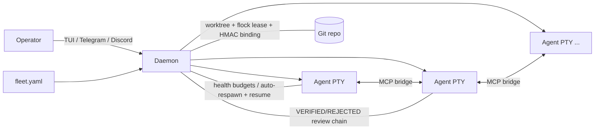

[English](competitor-comparison.md)

# 競品比較：AgEnD Terminal vs 2026 年的 Agent 編排版圖

> **資料來源 / 時效。** 本文整合自 2026-06 的一次多 agent 研究：一輪對 AgEnD 自身原始碼的
> grounding 盤點，加上十三個逐競品深度分析（開源競品經 clone 後讀原始碼，閉源競品以官方文件
> + 即時搜尋佐證）。與決策相關的事實經過對抗式查核（27 項關鍵主張，絕大多數獲確認，少數誤差
> 皆偏向**低估**競品）。**人氣、募資、版本數字皆為時間點快照（2026 年中），且會隨時間漂移**
> ——星數/募資欄請當作粗略規模訊號，而非即時報價。穩定的引用是架構與協調方式的描述，而非數字。
> 本文取代原本的三方比較（AgEnD vs Multica vs OpenAB），舊內容收進 §5.8。

## 1. 一句話總結

AgEnD Terminal 是一個**單一 operator、零基礎設施、即時控制層**，用來指揮一支 AI coding CLI
艦隊。它的可防禦護城河，是幾乎沒有任何競品能同時具備的組合：**即時 operator-in-the-loop 控制**
（多 pane TUI、`interrupt`、`pane_snapshot`、`replace_instance`）+ **結構化 review chain**
（VERIFIED/REJECTED 裁決、對 diff 驗證的 claim-verify trailer、自動派發 reviewer）+
**帶政策閘的 git-worktree 隔離**（per-branch flock lease、HMAC 簽章 binding、`agend-git`
deny matrix）+ **崩潰重啟並 resume 對話**——全部裝進三個自包含的 Rust binary，搭配 file-based
state。

版圖已遠遠超出原文件的兩個對象。市場現在分成八大類（§3）。誠實的張力：AgEnD 自承的三個最大缺口
——**脆弱的 PTY 螢幕刮取做 state detection**、**只有 worktree 的隔離**（共用 host
FS/依賴/網路）、**沒有結構化協定 / async-headless 模式**——正好是六七個彼此獨立的競品已收斂出更
好答案的領域（§8、§9）。而三個有資金的 incumbent（GitHub Agent HQ、Cursor 3.0 Agents
Window、Devin Desktop）如今正在執行 AgEnD 自己的 thesis，這拉高了「orchestrate, not just
run」必須代表什麼的門檻（§5.8、§11）。

## 2. AgEnD 的定位——控制層

Agent 工具堆疊有三個抽象層。AgEnD 佔據第三層：

| 層級 | 它是什麼 | 代表工具 |
|---|---|---|
| 通訊層 | chat ↔ agent 橋接 | OpenAB、chat-first bot |
| 管理層 | task → agent → report | Multica、Vibe Kanban、Task Master |
| **控制層** | **operator → fleet → 品質閘 → result** | **AgEnD Terminal** |

控制層的前提是：單一 power-user **即時指揮一支艦隊**——看著 live 輸出、在壞工作半途插手、在 task
被燒掉前修正方向、並讓結果通過結構化 review chain。這需要深度的 daemon-PTY 整合（`vterm.rs`、
`render/`、`layout/`、`keybinds.rs`）與一條協調脊柱（~30-36 個 MCP 工具、event-sourced
task board），而其他層在設計時並未承載這些。結構地圖見 [architecture.md](architecture.md)。

## 3. 版圖（八大類）

**粗體** = 與 AgEnD 架構最直接重疊的類別。

| 類別 | 代表（2026 年中規模訊號） | 隔離 | 與 AgEnD 的關係 |
|---|---|---|---|
| **終端 worktree-並行管理器** | **Claude Squad** (~7.8k★, Go)、**uzi** (~579★, 停更)、NTM / tmai / CAO（新群） | git worktree | 最接近的同類；都沒有 daemon、MCP board、review chain、recovery |
| **桌面 GUI 並行管理器** | **Conductor**（閉源, $22M A）、**Crystal/Nimbalyst** (~3k★, Electron)、**Sculptor**（Imbue, 容器）、**Cursor 3.0 Agents Window** | worktree / 容器 | 同 thesis，GUI 介面；Conductor 的 per-worktree 腳本 + port 是最乾淨的借鑒 |
| **kanban / 任務編排** | **Vibe Kanban** (~27k★, Rust, sunset)、Task Master (~27k★)、Backlog.md (~5k★)、Roo Boomerang | worktree / 無 | VK 出貨 ACP executor + scoped orchestrator MCP；Task Master 有 PRD→tasks + 依賴 DAG |
| **swarm / 函式庫框架** | claude-flow/Ruflo (~59k★)、claude-swarm、AutoGen（維護模式）、CrewAI (~48k★)、LangGraph（LangChain 獨角獸）、MetaGPT (~50k★)、OpenHands (~70k★) | 無 / 容器（僅 code 區塊） | 不真正監督 CLI；對 typed handoff、durable checkpoint、event-sourced state、headless 有價值 |
| **環境隔離 / sandbox runtime** | **container-use** (Dagger, ~3.9k★)、E2B (Firecracker)、Modal (gVisor)、Daytona | 容器 / microVM | 解 AgEnD #1 隔離缺口；應做成 opt-in tier |
| **雲端 / async coding agent** | Devin (~$26B 估值)、Jules、Cursor Cloud、Copilot coding agent、Factory (~$1.5B)、Codex cloud | 雲端 VM | 設定了「assign-issue → PR + headless + 手機觸發」的 UX 期待 |
| **互通協定** | **ACP** (Zed, ~3.4k★, 25+ agents)、A2A (Google→Linux Foundation)、MCP、AG-UI | 不適用（wire format） | ACP 是修 AgEnD 脆弱「眼睛」的最高槓桿 |
| **終端原生 / pair** | Warp Oz、Wave (~20k★)、tmuxai、Aider (~46k★) | 雲端 / 無 | Aider repo-map + tmuxai OSC-133 marker 是亮點借鑒 |

## 4. 架構最接近的同類（深度分析）

這些佔據 AgEnD 的同一個 niche：spawn N 個 coding agent，每個在自己的 git worktree。AgEnD 對
它們的護城河是 daemon + MCP 協調 + review chain + recovery；它們的教訓具體且便宜。

### 4.1 Claude Squad（`smtg-ai/claude-squad`, Go, ~7.8k★）
- **模型：** 每 agent 一個 tmux session + git worktree；管理器持有 PTY 去 `tmux attach`。
  worktree 在 `~/.claude-squad/worktrees/...`（`session/git/worktree.go`）。Pause = commit
  髒工作 + 移除 worktree（留分支）；Resume = 重加 worktree + 重接 tmux（`session/instance.go`）。
- **比 AgEnD 弱：** 無 flock lease、無 HMAC binding、無 daemon 管理 bind/release/GC、無 git
  policy gate、**完全沒有 inter-agent 協調**（已查核：只有一個 trust-prompt 螢幕刮取）。
- **可借鑒：** (a) *tmux-owns-the-process* 當 optional durable-PTY backend——daemon 死了
  agent 仍存活、可旁路重接；(b) *Pause = commit + 丟 worktree / Resume = 重加* 當第一級生命
  週期狀態，回收磁碟 + checkout 槽而不殺工作；(c) *alias-resolving spawn*（source shell rc、
  啟動前解開 alias）——AgEnD 的 PTY spawn 一定會踩「在我 shell 能跑、被 spawn 就不行」這一類。

### 4.2 Conductor（`conductor.build`, 閉源, 原生 macOS, $22M Series A）
- **模型：** 每 workspace 一個 worktree；與 AgEnD 同樣的 shared-host 模型。外部評測指出
  **沒有 spawn 前碰撞偵測、沒有自動 per-worktree DB/env 隔離**——負擔在使用者腳本上。
- **可借鑒（最高價值、完全契合哲學）：** *per-worktree 生命週期腳本 + 注入環境變數*——一組
  AgEnD 管理的 setup/run/archive hook，曝露 `AGEND_PORT`（自動配不衝突的 port）、
  `AGEND_WORKTREE_NAME/PATH`、`AGEND_REPO_ROOT`，讓每個 worktree 裝依賴、複製 gitignored 檔
  （`.env`）、跑 namespaced dev server。另：*archive + restore* 生命週期、*diff-hunk 當指令*
  （選一塊 hunk → 生成 scoped `send()`）。

### 4.3 Crystal / Nimbalyst（`stravu/crystal`, Electron, ~3k★）
- **模型：** 每 session 一個 worktree；**純靠 `--output-format stream-json`** 驅動 Claude
  ——不螢幕刮取（已查核；`claudeCodeManager.ts`）。
- **可借鑒：** (a) *結構化輸出 ingestion 模式*——解析 JSON 事件當 high-confidence state，刮取降
  為 fallback；(b) *per-prompt execution diff*——派指令前記 commit hash，算出該回合產生的 diff、
  keyed by prompt（`executionTracker.ts`）→ 強化 claim-verify；(c) *checkpoint commit 模式*
  （每回合 auto-commit）；(d) merge-back 前的安全 *`git merge-tree` 衝突預檢*；(e) interrupt/
  replace 時的 *遞迴 process-tree teardown*（只殺 PTY leader，AI CLI 會洩漏 node/mcp/build 子程序）。

### 4.4 uzi（`devflowinc/uzi`, Go, ~579★, 停更）
- **模型：** 每 agent 一個 worktree + tmux；auto-commit；per-agent dev server。
- **可借鑒：** (a) *per-agent dev server + 防衝突 port 配置* + fleet view 裡可點的預覽 URL——
  `findAvailablePort` 邏輯（`cmd/prompt/prompt.go`）約 20 行，可直接移植到 Rust；解鎖殺手場景
  *讓 N 個 agent 競同一個 UI 任務、並排 diff live preview*；(b) *`fleet run "<cmd>"`*——在每個
  worktree 跑同一條 shell 指令並收集 per-agent stdout/exit（有別於 prompt 廣播；要走 `agend-git`
  政策閘）；(c) live *diff-size 欄*（用 `git diff --shortstat HEAD` 避免動 index）。

### 4.5 Vibe Kanban（`BloopAI/vibe-kanban`, Rust + React, ~27k★, sunset）
- **模型：** 每 workspace 一個 worktree；預設 profile 為每個 agent 帶 full-autonomy/yolo flag
  （`crates/executors/default_profiles.json`），所以隔離完全靠 worktree。出貨真正的
  *Orchestrator MCP mode*（已查核：`create_session/run_session_prompt/get_execution/list_sessions`）。
- **可借鑒（AgEnD 可直接讀的 Rust 藍圖）：** (a) *ACP backend transport*——
  `crates/executors/src/executors/acp/harness.rs`（tokio + `agent_client_protocol` crate）
  是可重用的 piped-child + JSON-RPC harness；(b) *結構化 approvals/questions 協定*
  （`approvals.rs`）——agent 把 tool-permission / ask-user 請求當 typed event 發出；(c) *宣告式
  per-task action pipeline*（`ExecutorAction` linked list：setup → agent → cleanup → reviewer，
  靠 process exit 推進）；(d) *per-agent capability negotiation enum*；(e) *scoped orchestrator
  MCP mode*（刻意受限、workspace-scoped 的 tool router，剝掉 `delete_workspace`）。

## 5. 鄰近類別——各自教會我們的一件事

### 5.1 swarm 框架——claude-flow、claude-swarm
- **現實核查（已查核）：** claude-flow/Ruflo (~59k★) 是 coordination/memory **ledger，不是
  executor**——其 `AGENTS.md` 寫著「claude-flow does **NOT** execute code!」；「swarm/queen/
  consensus」跑在邏輯記憶體節點上（`Agent.executeTask` 是 no-op stub），「智慧路由」是 8 條 regex
  map（`router.cjs`），「neural」表面是 hash 偽 embedding。claude-swarm 在*共用*樹上給 per-instance
  directory + tool scoping。
- **可借鑒：** (a) *manifest 裡的 per-agent 工具權限 scoping*（per-role allow/deny matrix——便宜，
  硬化 shared-host 弱點）；(b) *dependency-graph / parallel-wave 執行*（upstream task VERIFIED 才
  自動派下游）；(c) *idle 時自動認領下一個 board task*。
- **不要抄：** queen/topology/consensus（Raft/Byzantine）層——它解一個 AgEnD 沒有的問題
  （operator *就是*決策權威）。

### 5.2 函式庫框架——AutoGen / CrewAI / LangGraph / MetaGPT
- **它們做得更好的（抽象，而非營運）：** 宣告式 topology 是 first-class、可序列化的 artifact
  （LangGraph `StateGraph`）；**durable per-step checkpointing**（time-travel、暫停數小時後
  resume）；對 roster 驗證的 **typed handoff** 訊息（`HandoffMessage.target`）；MagenticOne 的
  facts+plan+stall-count ledger。
- **AgEnD 較強之處：** 無真 agent 隔離（同一 Python event loop；一個 hang 卡住整個 loop）、它們
  編排 *API 呼叫* 而非真 coding CLI、無 live operator 控制、無 git policy、無 review chain。
- **可借鑒：** (a) 一個 typed `handoff` MCP 工具（target + reason + payload，對 roster 驗證、記上
  board）；(b) `fleet.yaml` 裡一個宣告式 `routes:` topology 區塊（coder → reviewer → coder）；
  (c) **fleet 級 durable checkpoint**——AgEnD 已 event-source board；升級成 fleet-wide 進度的可
  replay/resume checkpoint；(d) 語義 *stall 偵測*（還活著但在打轉，螢幕刮取抓不到）；(e) 有別於
  `set_waiting_on` 的 task-scoped `interrupt()` HITL。

### 5.3 autonomous 平台——OpenHands（`All-Hands-AI`, ~70k★）
- **針對 AgEnD #1 弱點的最佳老師。** 使用 typed、**event-sourced state model**（Action/Observation
  事件、filesystem EventService）——確定性、可 replay、不螢幕刮取。pluggable `SandboxService`
  （Docker/Remote/Process/none）證明隔離可以是可換策略。
- **AgEnD 較強之處：** 不是即時控制平面（為 fire-and-forget → PR 而生）、跨 top-level agent 無 peer
  inter-agent 協調、它本身*是*一個 backend（自己的 agent loop）而非 backend-orchestrator、重基礎設施
  （FastAPI + DB + Docker/K8s + React）。
- **可借鑒：** (a) **typed event stream 當主要真相、PTY 刮取當 fallback**——per-instance JSON event
  log 餵可靠 state；(b) *EventCallbackProcessor* bus（訂閱 typed event 觸發 auto-review / notify /
  respawn，取代 regex 觸發）；(c) *ProcessSandbox* 模式（無容器本地：子程序 + 唯一 port + session
  key + `/alive` 輪詢 + log-to-file 避免 pipe deadlock）；(d) *spawn-vs-delegate 拆分* + `max_children`
  上限，結果以 structured observation 回傳。

### 5.4 環境隔離 runtime——container-use（Dagger）、Sculptor、E2B/Modal/Daytona
- **真容器隔離**（container-use，已查核於 `repository/repository.go`、`environment/environment.go`）：
  每個 env 是 Dagger 容器（獨立 root FS、依賴、namespace）+ 專屬 git 分支 + 真 worktree；變更 export 回
  worktree 並 commit/push 到 per-repo bare fork；sidecar service 容器（DB/cache）+ port tunnel；secret
  以 Dagger secret 注入。E2B (Firecracker) / Modal (gVisor) 定義了 2026 年不可信 agent 程式碼的門檻
  （microVM）。
- **AgEnD 較強之處：** container-use **完全沒有編排/控制層**——無 fleet、role、schedule、recovery、
  resume、或 inter-agent 協調，且關係是*反的*（agent host spawn container-use；沒有東西監督 liveness）。
  硬依賴 Docker+Dagger 違反 AgEnD 的零基礎設施 ethos。
- **可借鑒：** (a) **opt-in 容器隔離 tier**——`fleet.yaml: isolation: worktree|container`，daemon 仍
  當 supervisor，只把 PTY child 放進 bind-mount *既有* worktree 的容器（誠實的中間路線：保留控制 +
  worktree-as-code，per-agent 換得 sandbox 安全）；(b) *git-notes 的 per-command audit trail*（`cu
  log/diff`——指令 + exit code + diff digest 在分支上，免 DB）；(c) *typed 多資源 flock lock manager*
  （讀 vs 寫，`repository/flock.go`）。

### 5.5 雲端 / async coding agent——Devin、Jules、Cursor、Copilot、Factory、Codex
- **它們設定了 UX 期待：** 真隔離（雲端 VM / network-off）、headless/async fire-and-forget、手機/Slack
  觸發、issue → PR。
- **它們的致命弱點：** review 只發生在最後（PR）。你不能看 live、不能在半途 ESC 打斷、不能在 task 被燒掉
  前修正方向——而純人工派發的 fan-out 會造成「Zero Alignment」失敗（重工、merge 衝突、review 積壓），
  因為 plan 從不共享。
- **可借鑒（借姿態，不借雲）：** (a) *本地 headless detach + 完成通知*（agent 在 operator 機器上 headless
  續跑、完成推 Telegram——複用 worktree/board/schedule/ci-watch，無雲端 VM）；(b) *issue → PR 當原生
  workflow* 但帶 AgEnD 結構化裁決（差異化：*已審查*的 PR，不是黑箱 self-review）；(c) **pre-flight 共享
  PLAN 閘**——把競品的對齊弱點變成 AgEnD 強項（agent 把 plan 貼到 board/decisions → operator/peer ack
  → 才寫 code）；(d) 走既有 channel 的 inbound *手機 dispatch/approve*；(e) *per-agent token burn-rate
  + budget cap*（cap-hit → auto-interrupt/pause）；(f) *Codex 式 network-off-per-task* 輕量 egress
  政策（不必上容器）。

### 5.6 互通協定——ACP、A2A、MCP、AG-UI
- **ACP（Agent Client Protocol, Zed）** 是修脆弱「眼睛」問題的最高槓桿借鑒：typed `tool_call_update`
  status/kind、`agent_thought_chunk`、`plan_update`、`StopReason`、一個 `session/request_permission`
  模型，以及 client 擁有 filesystem/terminal（拿到精確 diff + exit code 餵 claim-verify）。
- **誠實的限制：** ACP 給 **零多 agent 協調**（AgEnD 整個控制平面仍須 native）；backend 支援在 AgEnD 的
  集合裡不均（Gemini/Antigravity 強；Claude Code/Codex/Kiro/OpenCode 從 adapter-shim 到無），所以
  **ACP 是*第二*個 backend 模式、非取代 PTY**；v2 draft（2026-06）在變動中，先對 v1。
- **可借鑒：** (a) `fleet.yaml` 裡一個 *optional ACP client-mode backend*；(b) *把 ACP 的 typed state
  詞彙當 AgEnD 內部正規化 state schema*，即使 PTY 留著——這讓 regex 刮取變薄 adapter，並讓 review chain
  能 reason over typed 裁決（低工時、高槓桿、零基礎設施）；(c) 把 ACP 的 `session/request_permission`
  形狀當 AgEnD approval/permission 的標準 schema（統一 operator approval UX 與 `agend-git` deny
  matrix）；(d) 把 ACP 的 forward-compat 紀律（`_meta` passthrough + `Other(...)` enum fallback +
  handshake capability negotiation）套到 AgEnD 的 MCP schema。
- **A2A / AG-UI：** 哲學不符（A2A = HTTP 多組織雲端 mesh；AG-UI = 瀏覽器 generative-UI）。只在有具體
  interop 需求時做一個薄的 optional A2A egress shim。

### 5.7 終端原生 & pair——Aider、tmuxai、Warp、Wave
- **Aider**（~46k★，已查核零 MCP）：single-agent single-tree，但有一個 best-in-class *repo-map*
  （tree-sitter tag + PageRank 排序 + token budget + cache，`repomap.py`），AgEnD 無對等物；`AI!`/`AI?`
  註解觸發（`watch.py`）是新穎的 zero-TUI 控制面；architect/editor 是 planner/executor 拆分。值得注意：
  並行化 Aider 需要*外部*工具（dmux：每 agent 一個 tmux pane + worktree）——這驗證了 AgEnD 的內建設計。
- **可借鑒：** (a) 原生 *repo-map MCP 工具*（任何 fleet agent 可查的 backend-agnostic 程式碼索引）；
  (b) *OSC-133 semantic prompt mark* / shell-marker 注入當 high-confidence state oracle（tmuxai 的
  Prepare Mode；Warp/Wave/WezTerm/kitty 都支援），regex 當 fallback；(c) *architect → editor* handoff
  當真正的 fleet role（plan 當 board artifact、operator approval 閘、editor 在自己的 worktree）；(d) 每
  次編輯後的 *lint/test reflection loop* 當 opt-in supervisor 政策。

### 5.8 原文件對象 + 正在執行 AgEnD thesis 的 incumbent

**自原文件收進：**

- **Multica**（~32k★, Go + TS）——agent-HR 管理：web UI、issue board、多使用者共享 agent pool。
  *AgEnD 已吸收的教訓：* workspace GC、per-agent timeout、task metadata KV、boot orphan sweep、
  max-concurrent guard。*仍不要抄：* web UI / PostgreSQL / 多使用者 auth——它們溶解單 operator、零
  基礎設施、TUI-first 的差異化。
- **OpenAB**（~515★, Rust）——chat-first ACP 橋接，把 Discord/Slack/Telegram/LINE/Feishu/Google-Chat/
  WeCom 路由到任何 ACP CLI。*教訓：* 它的 ACP 使用強化 §5.6；它的 gateway 式 channel 架構比把 Telegram
  硬編進 daemon 乾淨。*非主要 UX：* AgEnD 不是 chatbot。

**如今進入 AgEnD 賽道的 incumbent（戰略壓力）：**

- **GitHub Agent HQ / Mission Control**（2026-02 預覽）——vendor-neutral 的「從一個介面 assign、monitor、
  steer 一支異質 agent 艦隊」，以雲端/PR-native SaaS 加上組織治理與 audit trail。這是 AgEnD 的 pitch 加上
  企業引力。*借框架：* 把 AgEnD 既有的 HMAC binding + deny matrix + commit trailer + 裁決紀錄做成 first-class
  的 **治理/audit log**——solo operator 不上 SaaS 就有企業級可追溯性。
- **Cursor 3.0 Agents Window**（2026-04）——側欄列出每個 active agent session，本地或雲端、**跨所有 repo**、
  最多 8 並行、可從 Slack/Linear/GitHub 觸發。*借多 repo 維度：* 把 fleet index 以 `(repo, agent, worktree)`
  為鍵，讓一個 operator 從一個 TUI 跑跨多 repo / monorepo 套件的 agent。
- **Devin Desktop**（Windsurf 改名, 2026-06）——Rust 寫的*本地* fleet manager，基於 ACP，帶「Spaces」共享
  context bundle。這是 AgEnD 的 thesis（本地、Rust、context handover）由一個採用 *ACP* 的有錢 incumbent 執行。
  *借「Spaces」：* 一個具名、持久、多 agent 讀寫的 context bundle——對 AgEnD 的 decisions/teams 是超越訊息
  傳遞的具體升級。

## 6. 功能矩陣

| 能力 | AgEnD | Claude Squad | Conductor | Crystal | Vibe Kanban | claude-flow | container-use | OpenHands | 雲端 agents |
|---|---|---|---|---|---|---|---|---|---|
| 即時 operator 控制（interrupt/snapshot/replace） | ✅ | partial (tmux) | partial (GUI) | partial | ❌ | ❌ | ❌ | ❌ | ❌ |
| 結構化 review chain（VERIFIED/REJECTED + claim-verify） | ✅ | ❌ | partial (PR comments) | ❌ | partial | ❌ | ❌ | ❌ | ❌ (self-review) |
| Inter-agent 協調（board + send/inbox） | ✅ | ❌ | ❌ | ❌ | ✅ (orchestrator) | ✅ (ledger) | ❌ | partial (in-conv) | ❌ |
| Git 隔離 | worktree + lease + HMAC + policy gate | worktree | worktree | worktree | worktree | shared FS | container + branch | container/clone | 雲端 VM |
| State detection | PTY scrape (+hooks) | scrape | n/a | **stream-json** | **ACP/structured** | n/a | **structural** | **event-sourced** | session API |
| 崩潰恢復 + resume | ✅ (respawn + resume) | 手動 | n/a | session resume | session restore (exp.) | ❌ | ❌ | ❌ | re-run |
| 隔離 tier ≥ 容器 | ❌ | ❌ | opt-in (user) | ❌ | ❌ | opt-in (WASM/cloud) | ✅ | ✅ | ✅ |
| Headless / async 執行 | ❌ | ❌ | ❌ | ❌ | partial | ✅ | ❌ | ✅ | ✅ |
| Plan layer（PRD→tasks, 依賴 DAG） | ❌ | ❌ | ❌ | ❌ | board only | partial (wave) | ❌ | ❌ | partial |
| 成本 / token 可觀測 | snapshot 工具 | ❌ | ❌ | ❌ | ❌ | ❌ | ❌ | partial | metered |
| 部署模型 | local daemon, 零基礎設施 | local CLI | Mac app | Electron | web/Tauri | npm + daemon + DB | Docker/Dagger | FastAPI+DB+Docker | 雲端 SaaS |
| Backend | 5 (PTY) | ~4 | Claude/Codex | Claude/Codex | many | Claude-centric | any MCP host | own SDK agent | own model |

## 7. AgEnD 的護城河（幾乎沒有競品能同時具備）

1. **即時 operator-in-the-loop 控制**——多 pane TUI、`pane_snapshot`、`interrupt`、
   `replace_instance`。雲端 agent 與函式庫框架沒有可比物；它們只在 PR 階段審查。
2. **結構化 review chain**——VERIFIED/REJECTED/UNVERIFIED 裁決、對 diff 驗證的 claim-verify trailer
   （`claim_verifier.rs`：syn-AST test 名稱抽取 + scope 比對）、自動派發 reviewer、dual-review、
   evidence block。十三個競品沒有任何一個有這個。
3. **帶治理的 worktree 隔離**——per-branch flock lease、HMAC 簽章的 `binding.json`、`agend-git`
   PATH-shim deny matrix + commit trailer。同類用 worktree 但都不 gate、不簽章。
4. **崩潰重啟並 resume 對話**——health budget、指數退避、auto-respawn 且 *resume* context。同類最多
   只有手動 restart。
5. **零基礎設施 fleet-as-code**——三個自包含的 Rust binary、file-based state、一份 `fleet.yaml`。
   無 DB、web server、容器 runtime、或雲端。

## 8. AgEnD 的誠實缺口（自承；競品會拿來打）

| 缺口 | 為何刺痛 | 誰做得更好 |
|---|---|---|
| **脆弱的 PTY 螢幕刮取** 做 state detection（「眼睛」） | regex 跨 backend 版本漂移 → 誤判 hang/idle、誤觸 recovery | Crystal (stream-json)、OpenHands (event stream)、container-use (structural)、ACP、tmuxai (OSC-133) |
| **只有 worktree 的隔離**（共用 host FS/依賴/網路） | 不安全於不可信程式碼；2026 門檻是 microVM | container-use、E2B/Modal/Daytona、雲端 agent、Codex (network-off) |
| **無結構化協定 backend 模式** | 把每個 backend 綁進客製刮取 | ACP、OpenHands app↔agent 拆分、Vibe Kanban harness |
| **無 async / headless / 雲端模型** | 需要常駐 daemon + 在場的 operator | 每個雲端 agent、claude-flow、Warp Oz |
| **無 plan layer**（分解、依賴 DAG） | 「人打字建 task」而非「指向 spec」 | Task Master、claude-swarm wave、LangGraph |
| **無 fleet 級成本/token 可觀測** | 「哪個 agent 在燒我預算 / 打轉？」無從回答 | LiteLLM、Helicone、Langfuse、Devin ACU |
| **單-repo 框架；Telegram-centric channel；單 operator；無 web/mobile** | 封死「指揮艦隊」的故事 | Cursor（多 repo）、OpenAB（channel gateway） |
| **context handover 是對話 replay**、非結構化 | 長工作的 resume 連貫 vs 漂移 | ACP `session/fork`、Devin「Spaces」、Amp handoff file |

## 9. AgEnD 可學什麼——優先排序的可借鑒功能

每項標註工時與哲學契合度。「契合」是對 AgEnD 的單 operator、零基礎設施、即時控制、worktree 隔離
thesis 而言。

### Tier 1——戰略級（修核心缺口；多個獨立競品驗證）

1. **結構化 / event-based state，PTY 刮取降為 fallback。** 加一個 ACP backend 模式，*並*先把 ACP 的
   typed state 詞彙當 AgEnD 內部正規化 schema（零基礎設施，讓刮取變薄 adapter）。再從 stream-json
   (Crystal) / 一個 ACP harness (Vibe Kanban `acp/harness.rs`) 餵 high-confidence 訊號。*來源：*
   ACP、Crystal、OpenHands、container-use、tmuxai、VK。**工時高 · 契合 yes。** *攻擊缺口 #1——單一
   最高槓桿的改動。*
2. **opt-in 容器隔離 tier**（`fleet.yaml: isolation: worktree|container`）：daemon 仍當 supervisor，
   把 PTY child 放進 bind-mount 既有 worktree 的容器。*來源：* container-use、Sculptor、OpenHands
   SandboxService、E2B/Modal。**工時高 · 契合 partial→yes。** *關閉缺口 #2 而不放棄零基礎設施預設。*
3. **per-worktree runtime：** 宣告式 setup/run/archive 腳本 + 自動 port lease + 複製 gitignored 檔
   + per-agent dev-server 預覽 URL。*來源：* Conductor、uzi。**工時中 · 契合 yes。** *攻擊 shared-host
   弱點最便宜的方式；解鎖「讓 N 個 agent 競同一個 UI 任務、比 live preview」。*
4. **plan layer：** 一個 PRD/spec → tasks 分解 MCP 工具，輸出到 event-sourced board + 一個 `blocked_on`
   欄 + 確定性 `next_task` resolver（priority → 最少未滿足依賴 → id，純 code）。*來源：* Task Master、
   claude-swarm、LangGraph。**工時中 · 契合 yes。** *關閉 plan-layer 缺口。*

### Tier 2——強化護城河 / 補 UX 缺口

5. **可執行的 review chain：** VERIFIED 前自動跑受影響 test 子集、附 pass/fail evidence block；加 per-turn
   execution diff (Crystal) 與 git-notes audit trail (container-use)。**工時中 · 契合 yes。** *升級 AgEnD
   最強的既有差異化。*
6. **本地 headless detach + 完成通知。** 只借本地 detach UX，絕不雲端 VM。**工時中 · 契合 partial。**
7. **per-agent 成本可觀測：** token burn-rate + 累計成本 + budget cap（cap-hit → auto-interrupt/pause +
   告警）；把既有 `tokens` 工具從快照升成串流計量。**工時中 · 契合 yes。**
8. **typed coordination 原語：** 一個 `handoff` MCP 工具、`fleet.yaml` 裡宣告式 `routes:`、fleet 級 durable
   checkpoint、stall 偵測、idle auto-claim、一個 scoped orchestrator MCP mode。*無 autonomous router、無
   consensus。* **工時中 · 契合 yes。**
9. **泛化權限/approval 政策：** 把 `agend-git` deny matrix 外化成宣告式政策，涵蓋所有 shell/tool/MCP 呼叫
   （OWASP 四柱：Permission / Approval / Audit / Kill-switch）。AgEnD 已有 kill-switch（`interrupt`）+ audit
   （trailer）。**工時中 · 契合 yes。** *把 operator-in-the-loop 變成安全姿態。*
10. **結構化 context handover：** 把 respawn-RESUME 從 raw replay 升級成結構化 handoff file（什麼必須存活 /
    決策 / 風險 / 未結 thread）+ 一個 durable「Spaces」式共享 context bundle。**工時中 · 契合 yes。**
11. **多 repo / monorepo fleet view：** 把 fleet index 以 `(repo, agent, worktree)` 為鍵。**工時中 · 契合 yes。**

### Tier 3——低成本快贏（小 PR、純契合）

- `fleet run "<cmd>"` 跨所有 worktree（走政策閘）。
- Fleet 儀表板：per-agent diff-size 欄（`git diff --shortstat HEAD`）+ Conductor 式「Checks」狀態行
  （git + CI + review-comment + todo）+ blocked badge。
- Alias-resolving spawn（source `~/.zshrc`、解開 alias）。
- interrupt/replace/respawn 時遞迴 process-tree teardown。
- 一鍵 named-profile picker，做 ad-hoc instance 建立（不必編 `fleet.yaml`）。
- OSC-133 semantic prompt mark 當 high-confidence state oracle（regex fallback）。
- Commit-trailer 政策精修（Aider 的 author vs committer vs Co-authored-by 矩陣）。
- Skills：多 scope 優先序 + slash/keyword 觸發 + 模板變數（OpenHands）；把 `skills-lock.json` 當可重現
  manifest，pin 共享 SKILL.md marketplace skill。
- ACP 式 forward-compat 紀律（`_meta` passthrough + `Other(...)` enum fallback + handshake capability
  negotiation）套到 MCP schema + 訊息封包。
- Aider repo-map 當 MCP 工具（backend-agnostic 程式碼索引）。
- `AI!`/`AI?` 程式碼註解觸發當第二個 zero-TUI 控制面。

## 10. AgEnD 不該抄什麼

| 項目 | 來源 | 為何不抄 |
|---|---|---|
| Web UI / Kanban GUI / SQLite + relay 棧 | Multica、Vibe Kanban | 溶解 TUI-first、零基礎設施、單 operator 差異化；Telegram/Discord 已更便宜覆蓋遠端 |
| consensus / queen / topology（Raft/Byzantine/gossip） | claude-flow | 對 operator 即決策權威的單 operator 模型是解不存在的問題；巨大複雜度、無實際價值 |
| A2A HTTP server / AG-UI | 互通協定 | 多組織雲端 mesh / 瀏覽器 generative-UI——都與單 operator TUI 衝突；只在有具體 interop 需求時做薄 A2A egress shim |
| K8s 部署 / Warp Drive 團隊雲同步 | OpenHands、Warp | 雲端/團隊基礎設施與本地零基礎設施對立 |
| Block/tile 拖拉 GUI 佈局 | Wave | 假設 Electron 桌面 app；不服務控制 thesis |
| fire-and-forget 當預設執行模型 | 雲端 agent | 擊敗 operator-in-the-loop 控制——當成*可選* detach 模式，而非預設 |

## 11. 戰略解讀與建議排序

市場進入「agent 管理時代」，而 GitHub Agent HQ、Cursor Agents Window、Devin Desktop 如今正用資本執行
AgEnD 自己的 thesis。「orchestrate, not just run」不再自明地差異化。AgEnD 的打法是**把可防禦的做到極致、
把 table-stakes 補上**：

- **守住並放大**（§7 護城河）：即時控制、結構化 review chain、git-policy 治理、零基礎設施。把治理/audit
  故事明確包裝出來——它就是 GitHub 用雲端收費的企業可追溯性，而 AgEnD 本地白送。
- **補上 table-stakes**（否則被框成「yet another tmux wrapper」）：結構化協定（Tier 1.1）、隔離 tier
  （1.2）、多 repo（2.11）、headless（2.6）、成本可觀測（2.7）。

風險調整後的順序：

1. **先做內部正規化 state schema**（Tier 1.1，低工時、零基礎設施）——內部採用 ACP 的 typed 詞彙，讓 review
   chain 在任何 ACP backend 落地前就能 reason over typed state。再接 stream-json / ACP harness 當
   high-confidence 來源。
2. **per-worktree runtime + 可執行 review**（1.3 + 2.5）——兩者都便宜、契合，且直接放大既有 worktree +
   review 護城河；合起來解鎖「競 N 個 agent、比 live preview」的強招。
3. **隔離 tier + 泛化政策引擎**（1.2 + 2.9）——執行邊界 + 授權邊界合成一個連貫的安全故事。
4. **plan layer + headless**（1.4 + 2.6）——把 AgEnD 從「live 駕駛」延伸到「白天 live、晚上無人值守」，
   複用 schedule/ci-watch。

一個反直覺的槓桿：雲端 agent 最大的弱點是「Zero Alignment」——純 fan-out 從不共享 plan，所以錯位只在 PR 階段
浮現。AgEnD 的 event-sourced board + decisions + operator-in-the-loop 正是讓 **pre-flight 共享 PLAN 閘**
成為 first-class 步驟的完美基質——把一個全類別的競品弱點變成 AgEnD 的強項。

## 12. 來源與方法

整合自 2026-06 的一次多 agent 研究 workflow：一輪對 AgEnD 原始碼的 grounding 盤點（README、
`architecture.md`、`MCP-TOOLS.md`、`claim_verifier.rs`、`dispatch_tracking.rs`、channels/skills/
schedules）加上十三個逐競品深度分析。開源競品（Claude Squad、Crystal、Vibe Kanban、uzi、claude-flow、
container-use、OpenHands、Aider、Task Master）經 clone 後讀原始碼並標註檔案路徑；閉源競品（Conductor、
Devin、Jules、Cursor、Factory、Sculptor）以官方文件 + 2026 年中搜尋佐證。一輪專門的對抗式查核核對了 27 項
與決策相關的主張（例如「這個工具真的協調 agent，還是只是隔離它們？」、「這個協定/功能真的存在嗎？」）；絕大多數
獲確認、未發現幻覺的工具/協定/募資，少數誤差皆偏向*低估*競品。當版圖有重大變動時更新本文，而非每次 release；
穩定的引用是架構描述，而非時間點數字。
